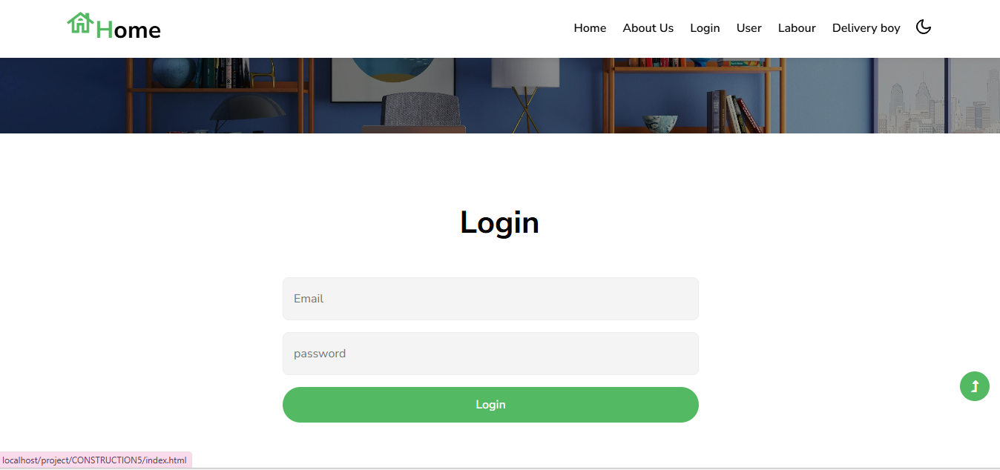
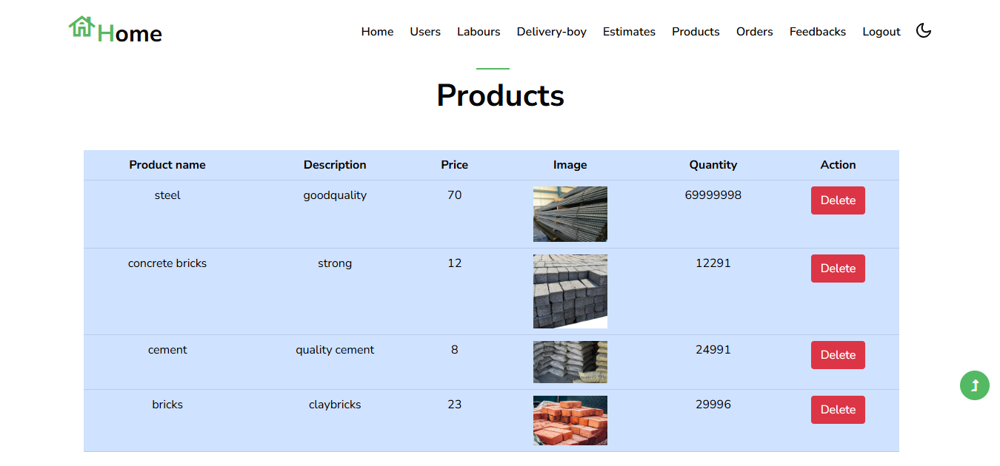
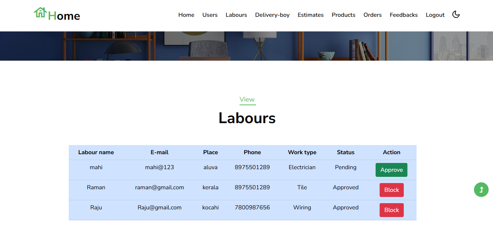

# Construction Management System

## Project Description
A web-based Construction Management System developed using PHP, MySQL, HTML, CSS, and JavaScript. The system helps manage construction activities, workers, users, and project-related information efficiently.

## Features
- User Registration and Login
- Admin Dashboard
- Worker Management
- Project Management
- Work Assignment
- Delivery Management
- Contact Module

## Technologies Used
- PHP
- MySQL
- HTML
- CSS
- JavaScript
- XAMPP

## Software Requirements
- XAMPP
- PHP
- MySQL
- Web Browser

## How to Run
1. Install XAMPP.
2. Copy the project folder into the htdocs folder.
3. Import the SQL database into phpMyAdmin.
4. Start Apache and MySQL.
5. Open the project in your browser.

## Author
**Seethal VS**
MCA Student

## Project Screenshots

### Login Page

### Home Page

### Admin Dashboard

### Product Management

### Worker Management

